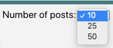

# Welcome to Spacetagram

  Spacetagram is an app to help share incredible photos from NASA’s Astronaut Picture of the Day(APOD) image API. You can checkout the live website [here](https://spacetagramy.netlify.app/). 
  

## Accessability

### Accessability testing

To measure how accessible my App is and how it could be improved, I used a browser extension called [WAVE](https://wave.webaim.org/).

Wave highlights possible issues that could come up when a visitor is using a screen recorder, some of the issues include: 
1. Not enough contrast in color between element and background
2. Heading structure is missing steps
3. Not enough Aria Labels are being used

### Heading Structure

  For accessability I was mindful to use a descending heading structure to differentiate between a section and a subsection. It is important to not skip heading levels in order to make it easily identifiable by screen readers. 

### Aria Labels

To accommodate screen readers further, I included Aria labels for all interactive elements for easy access.

## Likes

  The picture posts can be liked/un-liked by user. An instant feedback with some animation to confirm that the button has been clicked. 
  

  

  
How a liked button looks:

  
  
How an regular un-liked button looks:

   

  Shareable image links can be found on the "Copy URL" button on the bottom of the image card.

## Post Count

By default the app loads 10 posts containing random pictures their title and date taken all displayed in individual cards.

The user can change the amount of the posts displayed using a select input, every time the user changes the count number a new set of random posts will render from the API. 

Count Selection:

## Future Improvements

A future improvement that I am planning on doing is setup AWS so Spacetagram can be serverless. 

This would improve the like feature as a user would be able to store their likes in a more secure and consistent manner.

AWS includes services like DynamoDB as a database, using Lambda's to automatically trigger functions and API Gateway to set up API endpoints to link between the two.